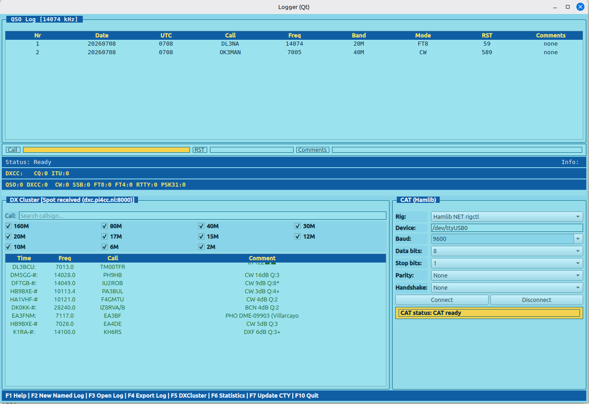

# Logger

Logger is an amateur radio logging application for entering QSOs, looking up DXCC information, and monitoring DXCluster spots.

The application uses shared controller/core logic, with Qt providing the user interface.


 

## What it does

- Records QSOs from the Qt desktop UI
- Displays DXCC, CQ zone, and ITU zone information while typing a callsign
- Shows a dedicated callsign suggestions panel in the top-right corner with all matching history entries
- Connects to a DXCluster server and shows received spots in the cluster window
- Tracks simple statistics
- Stores the QSO logbook and call history in SQLite
- Exports log data to CSV and ADIF files

## Features

- QSO entry with frequency, RST, and mode detection
- Callsign history suggestions with multi-match list view (top-right panel)
- Local DXCC lookup from a CTY database
- DXCluster status and spot display
- Invalid QSO marking for export exclusion
- CSV/ADIF export support, including custom ADIF filename
- One-key CTY database update from the internet
- SQLite-backed logbook and call-history storage with `LOGGER_DB_PATH` override
- New clean log action to truncate the current SQLite logbook and history
- Independent named logbooks stored in SQLite, with selection by ID or name

## Requirements

- C compiler (GCC or Clang)
- CMake
- make
- pthread support
- curl or wget (for CTY database download)

Optional for GUI frontend:

- Qt Widgets development package (Qt 5 or Qt 6)

On Debian/Ubuntu systems, install the required packages with:

```bash
sudo apt-get update
sudo apt-get install -y build-essential cmake
```

## Build

From the project root:

```bash
cmake -S . -B build
cmake --build build
```

Executables are created in the build directory:

- logger (GUI)

## Regression Tests

The project includes a regression suite in `tests/regression` that validates
core non-UI behavior:

- configuration parsing and defaults
- CTY database loading and callsign lookup
- QSO parsing, band/mode detection, and invalid toggle behavior
- statistics aggregation
- CSV and ADIF export content
- Maidenhead locator conversion

Run the tests with:

```bash
cmake -S . -B build
cmake --build build
ctest --test-dir build --output-on-failure
```

## Unit Tests

The project also includes unit tests in `tests/unit` to verify exported
non-UI functions from core modules:

- `app_controller`: shared frontend-independent key/state flow used by the Qt frontend
- `config`: `config_load`
- `cty`: `cty_load`, `cty_lookup`
- `qso`: `qso_init`, `qso_add`, `qso_mark_invalid`, `detect_band`, `detect_mode`
- `stats`: `stats_update`
- `export`: `export_csv`, `export_adif`
- `maidenhead`: `locator_to_latlon`
- `dxcluster`: `dxcluster_set_status`

UI rendering itself is intentionally not covered by automated tests and should
be verified manually.

Run all tests (regression + unit):

```bash
cmake -S . -B build
cmake --build build
ctest --test-dir build --output-on-failure
```

## Run

```bash
cd build
./logger
```

## Notes

- The application is intended for desktop environments.

## Configuration

The application reads a configuration file named logger.conf from the working directory.

Example configuration:

```ini
LAT=21.104127
LON=37.300154
LOCATOR=AA00AA

DXC_HOST=dx.da0bcc.de
DXC_PORT=7300
DXC_CALL=AAXAAA
```

### Configuration fields

- LAT: latitude of your station
- LON: longitude of your station
- LOCATOR: Maidenhead locator of your station
- DXC_HOST: DXCluster hostname
- DXC_PORT: DXCluster TCP port
- DXC_CALL: your callsign used for cluster login

## Commands

While running the application, you can use these commands in the input line:

- export: write log.csv and log.adi
- export mylog.adi: write log.csv and custom ADIF file mylog.adi
- invalid: mark the most recent QSO as invalid so it is skipped by exports
- newlog / clear: create a new clean logbook and clear call-history suggestions
- newlog My Contest Name: create and switch to a new empty logbook with the given name
- prevlog / openprev / previous: reopen the previous logbook snapshot from SQLite
- logs: list named log archives stored in SQLite
- openlog 12: open a named log archive by ID
- openlog My Contest Name: open the newest logbook that matches the given name
- quit: exit the program

## Function keys

- F1: help/status hint
- F2: create a new clean logbook and clear call history
- F3: reopen the previous logbook snapshot from SQLite
- F4: prompt for ADIF filename, then export CSV and ADIF using the entered ADIF name
- F5: toggle DXCluster fullscreen view
- F6: recalculate statistics
- F7: download the latest wl_cty.dat and reload CTY entries
- F10: quit

## Callsign suggestions

When you start typing the first token (callsign), Logger checks the SQLite-backed
call history and shows all matching callsigns in a separate window in the top-right corner.

- Suggestions are ordered by recency (newest first)
- Use Up/Down arrows to select a different suggested callsign
- Press Space to apply the currently selected suggestion and continue with the next field
- Press Tab to apply the currently selected suggestion
- Suggestions are shown only while editing the first token

## Data files

The program expects the DXCC database file named wl_cty.dat in the working directory or in the build directory.

When F5 is used, wl_cty.dat is downloaded and replaced in the current working directory.

The QSO logbook and call history are stored in `logger.db` by default. Set
`LOGGER_DB_PATH` to point at a different SQLite file if you want to keep the
database elsewhere. The first run imports existing `call_history.txt` entries
into SQLite if the database is empty.

`logger.conf` and `wl_cty.dat` remain text-based files.

## Notes

- The application uses Qt Widgets, so it is intended for desktop environments.
- DXCluster connectivity depends on the configured host, port, and network access.
- If you want to use a different DXCluster server, update DXC_HOST and DXC_PORT in logger.conf.
